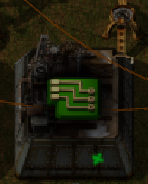

#Assembler Light

Adds a small light to the front of active assemblers. This can aid in the
detection of bottlenecks.

The graphic is super janky. Happy to accept a pull request for a better
animation.
